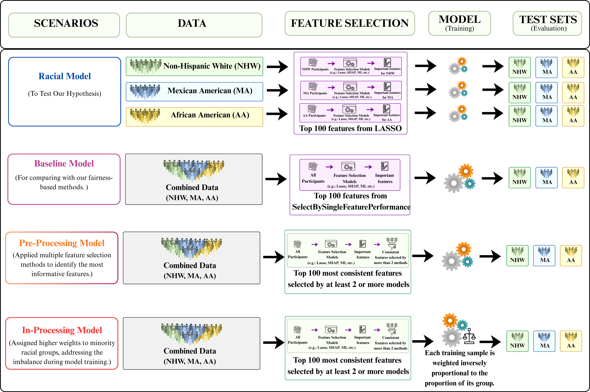

# Evaluating Fairness and Generalizability of Alzheimer’s Disease Diagnosis Models

This repository contains the code, and architecture figure for a machine learning study evaluating racial fairness and generalizability in Alzheimer’s disease diagnosis models. The project investigates whether models trained on one racial or ethnic group generalize well to other groups, and whether fairness-aware preprocessing and in-processing strategies can reduce prediction bias.

📄 **Preprint:** [Read the full manuscript on bioRxiv](https://www.biorxiv.org/content/10.1101/2025.09.30.678854v1.full)

## Project Overview

Alzheimer’s disease diagnosis models can perform differently across racial and ethnic groups when training data is imbalanced or not diverse. This project uses the HABS-HD dataset to evaluate model performance and fairness across three groups:

- African American
- Mexican American
- Non-Hispanic White

The main hypothesis is that models trained on a single racial or ethnic group perform best on that same group but may generalize poorly to other groups.

## Architecture

The full experimental workflow is shown below.



The architecture contains four experimental scenarios:

1. **Racial Model**  
   A model is trained separately on each racial group using the top 100 LASSO-selected features, then tested across all racial groups.

2. **Baseline Model**  
   A model is trained on combined data from all racial groups using top features selected by `SelectBySingleFeaturePerformance`.

3. **Pre-processing Model**  
   Multiple feature selection methods are combined to identify the most consistent and informative features.

4. **Pre + In-processing Model**  
   The pre-processing feature set is used with inverse group-proportion sample weighting to give higher importance to underrepresented groups during training.


## Code Description

### `Racial_model.py`

Runs the race-specific modeling experiment. For each racial group, the script selects the top features, trains a Random Forest classifier, and evaluates performance on the same group and the other racial groups.

Outputs include:

- Balanced accuracy
- Macro F1
- Demographic parity
- Equalized odds
- Equal opportunity related metrics

### `Baseline.py`

Runs the baseline model using combined data from all racial groups. The model is trained on racially diverse data and evaluated separately across each racial test group.

### `Pre_Processing_Feature_Selection.py`

Combines outputs from multiple feature selection methods and identifies features that are consistently selected by at least two or more methods. These features are used for the fairness-aware pre-processing model.

### `Pre_Processing_model.py`

Runs the fairness-aware pre-processing model using the selected stable features. This script evaluates whether consistent feature selection can reduce bias while maintaining prediction performance.

### `Racial_Statistical_Test.py`

Performs statistical testing between in-group and cross-group model performance using:

- Welch’s t-test
- Cohen’s d effect size

The output helps determine whether performance differences across racial test groups are statistically significant.

## Dataset

This project uses the HABS-HD dataset. The dataset is not included in this repository because it may contain sensitive clinical information.

Expected input file:

```text
final_preprocessed_HABS_new.csv
```

Feature selection result folders expected by the scripts:

```text
Racial_Feature_Selection_Results/
Combined_Feature_Selection_Results/
```

### Dataset Access

This project uses data from the Health and Aging Brain Study - Health Disparities (HABS-HD) cohort.

The dataset is not publicly distributed through this repository due to participant privacy and clinical data access restrictions.

Researchers interested in accessing HABS-HD data can request access through official HABS-HD website or contact the study administrators for the latest data access policies and application procedures. https://apps.unthsc.edu/itr/data

## Evaluation Metrics

### Performance Metrics

- Balanced accuracy
- Macro F1 score

### Fairness Metrics

- Demographic Parity
- Equalized Odds Difference
- Equal Opportunity

For performance metrics, higher values are better. For fairness disparity metrics, lower values indicate better fairness.

## Key Findings

The results support the hypothesis that models trained on a single racial group perform best on that same group but often show reduced performance on other groups. Training with combined racial data improves generalization, but fairness disparities may still remain. The fairness-aware pre-processing and pre + in-processing approaches reduce fairness gaps while maintaining strong predictive performance.


## How to Run

Run scripts from the project root folder depending on where your data files are stored.

Example:

```bash
python Racial_model.py
python Baseline.py
python Pre_Processing_Feature_Selection.py
python Pre_Processing_model.py
python Racial_Statistical_Test.py
```

## Notes

Before running the scripts, make sure the required CSV files and feature selection result folders are available in the expected directory.

